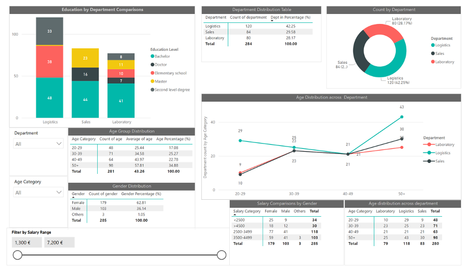

# Employee Survey Analytics Project (HR & People Analytics) 📊


👉 [Download the PowerBI report](./dashboards/Data%20survey.pbix)

## 👋 Introduction

This project demonstrates my ability to apply **data analytics to real-world HR challenges**.  
It analyzes employee survey data to uncover **demographic patterns, satisfaction trends, and organizational risks**, translating data into **clear, actionable business insights**.

It compiles key tables, charts, and recommendations to help leadership prioritize improvements that enhance engagement, equity, and retention.

## ✅ Executive Summary

- **Strongest areas:** Co-worker relationships and company benefits show consistently high satisfaction.
- **Weakest areas:** Salary and management satisfaction are the two largest pain points across departments and demographics.
- **Department gap (Working environment):** Sales rates well above average while Logistics is notably below average.
- **Age & salary patterns:**
  - Younger employees (20s) prioritize **career direction**.
  - Mid-career staff (30s–40s) seek **workload balance**.
  - Older employees (50+) value **ergonomic support** and **reliable benefits**.

---

## 🧠 Business Problem

Organizations often collect employee survey data but fail to convert it into **actionable insights**.  
This project answers key HR questions such as:

- What factors drive employee dissatisfaction?
- How do satisfaction levels differ by department, age, salary, and education?
- Where should leadership prioritize interventions to improve engagement and retention?

## 🎯 Objectives

- Examine workforce demographics (gender, age, education, department, salary).
- Measure employee satisfaction across key organizational factors.
- Identify disparities between demographic and departmental groups.
- Deliver data-driven recommendations to improve engagement, equity, and retention

## 📁 Repository Structure

```bash

DATA_SURVEY_POWERBI/
├── dashboards/
│   ├── Data survey.pbix          # Power BI file
│   └── DAX.md                    #  Few of DAX measures used in the Power BI dashboards
├── data/
│   └── Sample_data.xlsx          # Source dataset(s)
├── img/                          # Figures used in README/report
│   ├── Gender_age_department_distr.png
│   ├── Salary_distribution.png
│   ├── Satisfaction_1.png
│   └── Satisfaction_2.png
├── reports/
│   ├── Data survey analysis.pdf  # Management report
│   ├── Data survey analysis.docx # Editable report
│   └── Data survey.pdf           # Alternate/short report
│    
├── README.md                     # Project overview, usage, and links
└── .gitignore                    # Ignore large/binary and local caches
```

## 📊 Data Overview

### Respondent Profile

- **Sample size:** 285 employees (Gender table).
- **Gender:** 63% female, 36% male, ~1% other.
- **Age groups:** 20–29 (17%), 30–39 (25%), 40–49 (23%), 50+ (35%); mean & median age ≈ 43 years.
- **Education:** Bachelor (47%), Elementary (17%), Second level degree (15%), Master (13%), Doctor (8%).
- **Departments:** Logistics (42%), Sales (30%), Laboratory (28%).
- **Survey scale:** 1–5  
  - 1 = Highly Unsatisfied  
  - 5 = Highly Satisfied

### Salary Snapshot

- **Overall mean salary:** €3,425; **min–max:** €1,300–€7,200; **SD:** ~€829.
- **Largest bands:** €2,500–€3,499 (118 employees) and €3,500–€4,499 (103 employees).

### Core Variable Groups

- **Demographics:** Gender, Age, Education
- **Organizational:** Department, Salary
- **Satisfaction Factors:**  
  Management, Co-workers, Working environment, Salary, Work tasks, Benefits, Career development

---


## 🔬 Methodology & Analytical Approach

This document explains the analytical methodology used in the *Employee Survey Analytics Project*.  
It is designed for transparency, reproducibility, and recruiter review.

### Data Collection

- Internal employee survey (fictional)
- Cross-sectional dataset
- Anonymized responses

### Measurement Scale

All satisfaction variables use a **5-point Likert scale**:

1. Highly Unsatisfied  
2. Unsatisfied  
3. Neutral  
4. Satisfied  
5. Highly Satisfied

### Analytical Techniques

#### 1. Descriptive

- Mean
- Median
- Standard deviation
- Minimum and maximum values
- Percentage

Used to understand central tendencies and variability in satisfaction scores.

#### 2. Group

Comparisons were conducted across:

- Department
- Age category
- Salary category
- Education level
- Gender
  
- Comparison details
  - **Education by Department:** Laboratory and Sales skew toward higher academic qualifications; Logistics is more practice-oriented.
  - **Salary vs. Education:** Higher education correlates with higher salary brackets across the board.
  - **Salary vs. Gender:** Men are over-represented in >€4,500 bracket despite smaller share of workforce; women concentrated in lower/mid bands.
  - **Age distribution by Department:** Logistics has the largest share of 50+ employees; Laboratory and Sales are more balanced.

This allowed identification of structural and demographic differences.

#### 3. Cross-Tabulation

- Salary vs Education
- Salary vs Gender
- Education vs Department
- Age vs Department

Used to detect patterns and potential inequities.

#### 4. Visual Analytics

- Bar charts
- Distribution charts
- Comparative plots

Visuals were used to highlight gaps and trends clearly for stakeholders.

---

### Analytical Focus

Rather than advanced predictive modeling, the analysis prioritized:

- Interpretability
- Actionability
- Business relevance
- HR decision support

---

### 😊 Satisfaction Metrics (1–5 scale)

Overall means:

- **Management:** 2.54 (median 2.0) — lowest area.
- **Co-workers:** 3.72 (median 4.0) — highest area.
- **Working environment:** 2.89.
- **Salary:** 2.31 — widespread dissatisfaction.
- **Work tasks:** 2.68.
- **Company benefits:** 3.36.
- **Career development:** 3.03.

#### Differences by Group

- **Department:** Sales has the highest working environment score (~4.04); Logistics the lowest (~2.05). Salary satisfaction is low everywhere (≈2.12–2.41).
- **Age:** Younger staff rate co-workers highest but are least satisfied with salary; older staff (50+) find tasks more fulfilling but show lower career development scores.
- **Salary Category:** Higher salary correlates with better environment/benefit/task satisfaction, but **management** satisfaction remains low across all bands.
- **Gender:** Largest gap appears in **salary satisfaction** (female ≈2.55 vs. male ≈1.85); co-worker satisfaction is high for all. *(Note: “Other” group results are impacted by very small n).*

---


## Data Description

---

### Variables Description



#### Demographic Variables

| Variable | Description |
|--------|------------|
| Gender | Male, Female, Other |
| Age | Numerical age |
| Age Category | 20–29, 30–39, 40–49, 50+ |
| Education Level | Elementary, Second Level, Bachelor, Master, Doctor |
| Department | Logistics, Laboratory, Sales |

---

#### Compensation Variables

| Variable | Description |
|--------|------------|
| Salary | Monthly salary in euros (€) |
| Salary Category | <2500, 2500–3499, 3500–4499, >4500 |

---

#### Satisfaction Variables (Likert Scale 1–5)

| Variable | Description |
|--------|------------|
| Sat_Management | Satisfaction with management |
| Sat_Coworkers | Satisfaction with co-workers |
| Sat_Environment | Satisfaction with working environment |
| Sat_Salary | Satisfaction with salary |
| Sat_Tasks | Satisfaction with work tasks |
| Sat_Benefits | Satisfaction with company benefits |
| Sat_Career | Satisfaction with career development |

---

#### 📊 Sample Data (Extract)

A preview of representative dataset rows:

| Employee_ID | Gender | Age | Department | Education Level | Salary (€) | Sat_Management | Sat_Coworkers | Sat_Environment | Sat_Salary |
|-------------|--------|-----|------------|------------------|-------------|----------------|----------------|------------------|------------|
| 1 | Female | 43 | Logistics | Bachelor | 3100 | 2 | 4 | 3 | 2 |
| 2 | Male | 29 | Sales | Master | 4500 | 3 | 5 | 4 | 3 |
| 3 | Female | 51 | Laboratory | Doctor | 5200 | 4 | 4 | 4 | 3 |
| 4 | Other | 35 | Logistics | Secondary | 2400 | 1 | 3 | 2 | 1 |
| 5 | Female | 38 | Sales | Bachelor | 3900 | 2 | 4 | 4 | 2 |

---


## 📊 Key Insights

### What Works Well ✅

- **Strong co-worker relationships** across all departments (**62.8% rated 4–5**)  
- **Company benefits** are positively perceived (**49.8% rated 4–5**)
- Education aligns well with role complexity

### Critical Risks ⚠️

- **Salary dissatisfaction** is widespread across all groups
- **Management satisfaction** is consistently low
- **Logistics department** shows poor working environment scores

### Strategic Patterns

- Younger employees prioritize **career development**
- Mid-career staff value **workload balance**
- Senior employees seek **ergonomic support & stability**
- Higher education strongly correlates with higher pay
- Gender pay gaps emerge in higher salary bands

---

### 🏢 Department-Level Findings

| Department | Key Observation |
|----------|-----------------|
| Logistics | Lowest management & environment satisfaction |
| Laboratory | Strong career alignment & task satisfaction |
| Sales | Best-rated work environment & salary perception |

---

## 🧭 Recommendations

1. **Salary transparency & adjustments** — prioritize equity in lower-paid units (e.g., Logistics) and review mid-band disparities.
2. **Leadership capability uplift** — targeted training, feedback loops, and manager accountability to address the lowest-scoring area.
3. **Workplace improvements** — replicate Sales’ environment best practices in Logistics and other operational areas.
4. **Age-tailored support** — career guidance for 20s, workload planning for 30s–40s, ergonomic flexibility for 50+.
5. **Quarterly pulse surveys** — measure progress against baseline distributions and keep interventions data-driven.

These actions support **employee engagement, retention, and organizational performance**.

---


## Figures Overview

- **Figure 1:** Department Distribution  
  → Logistics is the largest department, indicating operational workforce dominance.

- **Figure 2:** Education by Department  
  → Laboratory and Sales show higher academic concentration than Logistics.

- **Figure 3:** Salary by Department and Education  
  → Higher education consistently correlates with higher salaries across all departments.

- **Figure 4:** Age Distribution Across Departments  
  → Workforce is generally mature, especially in Logistics and Sales.

- **Figure 5:** Overall Satisfaction Averages  
  → Management and salary receive the lowest satisfaction scores.

- **Figure 6:** Satisfaction by Department  
  → Sales outperforms Logistics in work environment satisfaction.

- **Figure 7:** Satisfaction by Age Category  
  → Younger employees value career development; older employees value task fit.

- **Figure 8:** Satisfaction by Salary Category  
  → Higher salary improves environment satisfaction but not management satisfaction.

- **Figure 9:** Satisfaction by Gender  
  → Salary satisfaction shows the greatest gender-based disparity.

- **Figure 10:** Satisfaction by Education Level  
  → Higher education aligns with better task, benefit, and career satisfaction.

---

## 🛠 Usage

Follow these steps to make the most of the report and dashboard:

1. **Open the PDFs**:
   - `Data survey analysis.pdf` → For full tables, charts, and detailed interpretations.
   - `Data survey.pdf` → [For quick visual summaries and comparisons](./reports/Data%20survey.pdf).

2. **Interpret Key Metrics**:
   - Focus on satisfaction scores (1–5 scale) to identify priority areas.
   - Use demographic tables to understand workforce composition.

3. **Apply Insights**:
   - Share the **Executive Summary** with leadership for strategic decisions.
   - Use department-level charts to plan targeted interventions.
   - Monitor progress using quarterly pulse surveys aligned with baseline data.

4. **Integrate into Workflow**:
   - Include recommendations in HR and management planning.
   - Use salary and education insights for compensation and training strategies.

> Tip: For presentations, extract Figures 6–10 from the analysis PDF and embed them in slides.

## 📦 Reuse & Attribution

If you reuse charts or tables, please cite **Femi Oyinloye, “Management Report: Employee Demographics, Satisfaction Trends, and Actionable Insights,” December 2025** and link to the PDFs in this repository.

## 🛠️ Skills Demonstrated

- HR & People Analytics
- Survey data analysis
- Data storytelling for stakeholders
- Business-focused reporting
- Visualization-driven insight generation

---

## 👤 Author

**Femi Oyinloye**  
FullStack Developer | Data Analysis | Business Insights  
