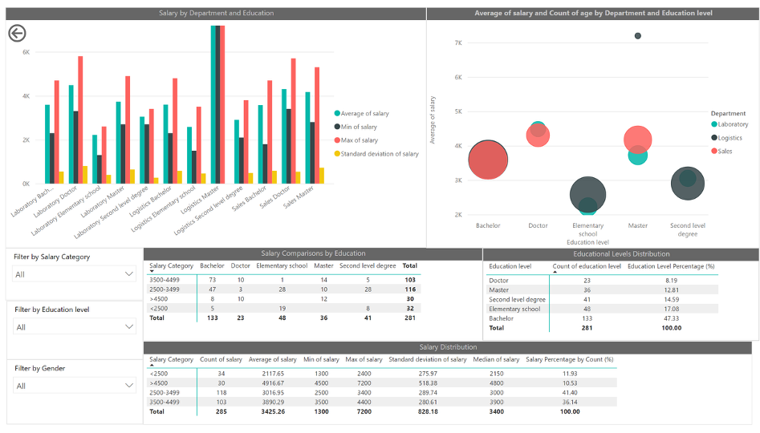
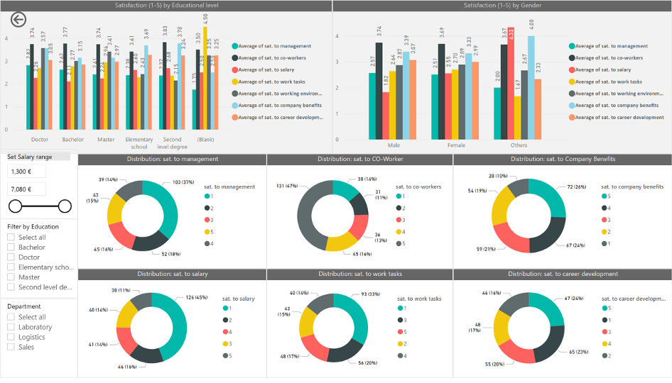
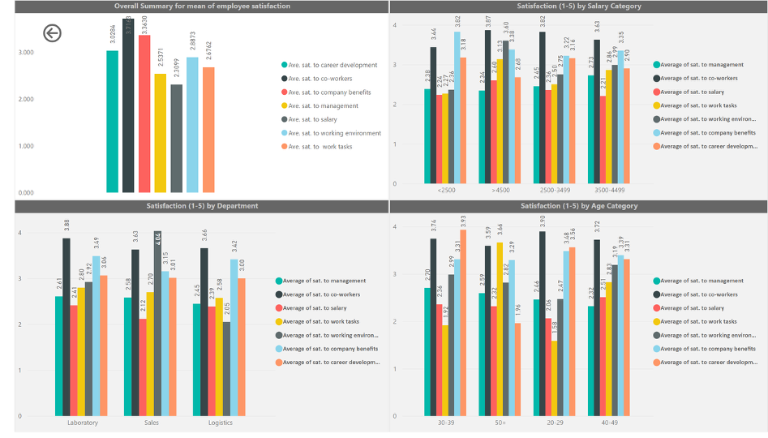

# Power BI Analysis and Visualization Project

---
title: "Power BI Analysis and Visualization Project"\
author: "Femi Oyinloye"\
course: "Data-driven Decision Making"\
institution: "Laurea University of Applied Sciences"\
date: "27/12/2025"

---

## Cover Page

**Author:** Femi Oyinloye  
**Course:** Data-driven Decision Making  
**Institution:** Laurea University of Applied Sciences  
**Submission Date:** 12/2025  

---

## Table of Contents

1. Executive Summary  
2. Introduction  
3. Task Description  
   3.1 Expected Outcomes  
4. Process Description  
   4.1 ETL Process  
5. Dashboard Creation Process  
   5.1 Gender, Age and Department Dashboard  
   5.2 Salary Distribution Dashboard  
   5.3 Employee Satisfaction Analysis  
6. Strategic Implications and Recommendations  
7. Conclusion  
8. Glossary  
9. References  
10. Figures  

---

## 1. Executive Summary

This report presents an integrated analysis of the organization’s workforce, drawing on data from Power BI dashboards covering workforce composition, salary and education, and employee satisfaction. The organization employs approximately 284 individuals across three core departments: Logistics, Sales, and Laboratory.

Overall, the workforce is predominantly female and relatively mature, with the largest proportion of employees in the 30–39 and 50+ age categories. Salaries range from €1,300 to €7,200. Data inconsistencies were identified and must be resolved before advanced analytics.

---

## 2. Introduction

The purpose of this report is to synthesize workforce, compensation, education, and satisfaction data into a coherent narrative that supports strategic human resource planning.

---

## 3. Task Description

This task involved analysing workforce, compensation, education, and employee satisfaction data using Power BI dashboards.

### 3.1 Expected Outcomes

The expected outcome is a clear, data-driven understanding of workforce composition, compensation structures, and employee satisfaction to support HR decision-making.

---

## 4. Process Description

The process included data cleaning and transformation in Power Query, data modelling, DAX calculations, and dashboard development.

### 4.1 ETL (Extraction, Transform and Load) Process

#### Data Extraction

Excel files were imported into Power BI using *Get Data* functionality.

#### Data Cleaning

- Verified unique primary keys  
- Checked missing values  
- Validated date formats  
- Standardised age, salary, and satisfaction fields  

#### Data Transformation

- Converted numeric fields  
- Grouped age and salary categories  

#### Data Loading and Modelling

Data was loaded into a star-schema model with defined relationships.

---

## 5. Dashboard Creation Process

### 5.1 Gender, Age and Department Dashboard

- **Figure 2: Department and Gender Distribution Dashboard design in Power BI**

Logistics accounts for approximately 42% of employees, followed by Sales (30%) and Laboratory (28%). Females represent 63% of the workforce.

---

### 5.2 Salary Distribution Dashboard

- **Figure 3: Salary Distribution Dashboard design in Power BI**

Salaries range from €1,300 to €7,200 with an average salary of €3,425.

---

### 5.3 Employee Satisfaction Analysis

- **Figure 4: Employee Satisfaction Analysis Dashboard design in Power BI**

Career development has the highest satisfaction score, while work tasks and environment rank lowest.

- **Figure 5: Employee Satisfaction Analysis Dashboard design in Power BI Part 2**

---

## 6. Strategic Implications and Recommendations

- Implement succession planning in Logistics  
- Increase early-career hiring  
- Improve working conditions and job design  
- Conduct pay equity analysis after data correction  

---

## 7. Conclusion

The analysis demonstrates strong relationships between education, salary, and employee satisfaction. Reliable data and continuous monitoring are essential for informed HR decision-making.

---

## 8. Glossary

**ETL:** Extract, Transform, Load  
**DAX:** Data Analysis Expressions  
**Star Schema:** A data modelling structure connecting fact and dimension tables  

---

## 9. References

Microsoft. (2025). *Visualization types in Power BI*. Microsoft Learn.

---

## 10. Figures

Figure 1: Data Model view diagram  
Figure 2: Department and Gender Distribution Dashboard design in Power BI  
Figure 3: Salary Distribution Dashboard design in Power BI  
Figure 4: Employee Satisfaction Analysis Dashboard design in Power BI  
Figure 5: Employee Satisfaction Analysis Dashboard design in Power BI Part 2
